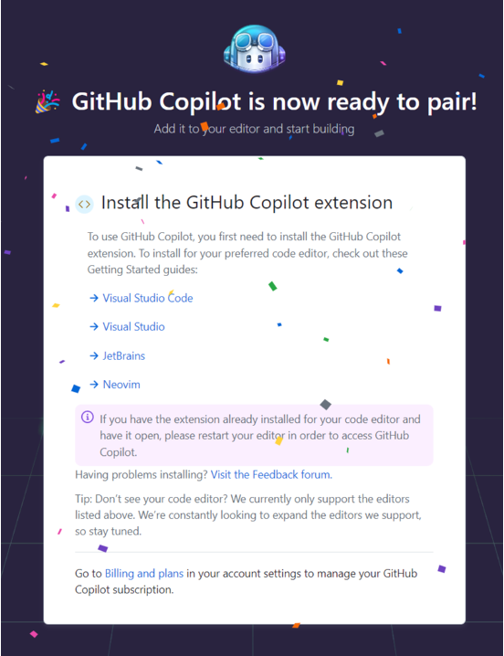
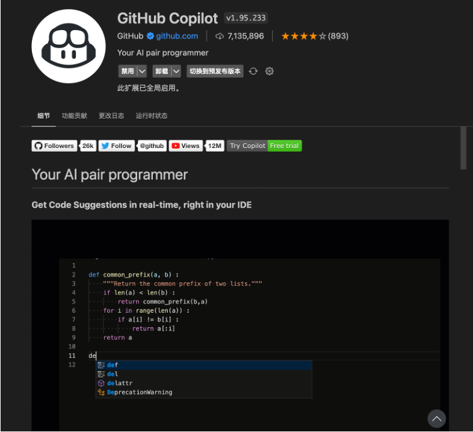
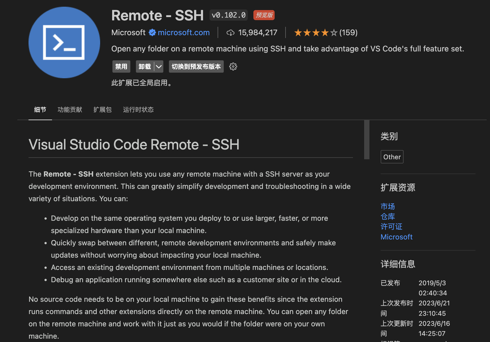
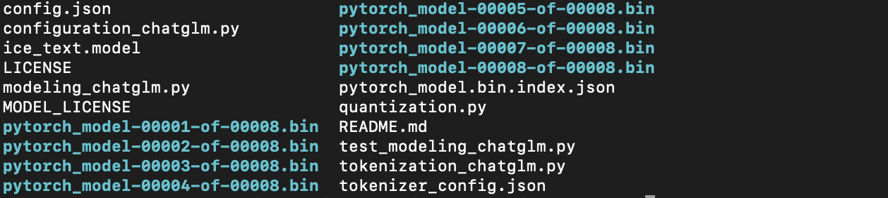

# AIGC2023

🔊 本仓库为2023年夏季学期AIGC课程创建，内含实验所需部分资料
🤖 时间安排
- 第一次实验课7月16日晚上
- 第二次实验课7月23日晚上

***

## 💬 Github Copilot

🔉 实验要求：
1. 完成Github Copilot工具的前期准备，获得Copilot工具使用权限，配置工具扩展
2. 熟悉Github Copilot工具使用，体会Prompt构造的方法，使用Copilot工具编写一个2048游戏

### 前期准备

Step1 注册GitHub: [https://github.com](https://github.com/) ☝️为后续学生认证方便最好使用edu邮箱

Step2 认证Github Student Developer Pack: [https://education.github.com/pack](https://education.github.com/pack) ☝️需要几天时间认证通过
- 登陆github主页，点击头像，侧边栏选择`Try Copilot`，根据提示操作，如果出现下面烟花说明具备Copilot使用权限



Step3 安装并配置VS Code: [https://code.visualstudio.com/download](https://code.visualstudio.com/download) ☝️ 也可以选用自己熟悉的支持Copilot扩展的编程工具
- 在VS Code中搜索并安装Github Copilot扩展，并登陆自己的学生认证成功的Github账号即可使用



- 在VS Code中搜索并安装Remote SSH扩展，用于远程连接服务器



安装完成后，VS Code侧栏会出现小电脑图标，点击后会显示电脑配置的SSH连接

- 配置电脑SSH连接服务器

`ssh -L post:localhost:host_port username@server_ip -p ssh_port`是标准的SSH连接命令，其中`post`为本地端口，`host_port`为服务器端口，`username`为服务器用户名，`server_ip`为服务器ip地址，`ssh_port`为服务器SSH端口，每次连接服务器都需要输入密码和繁琐的SSH连接命令，为了方便，可以在本地配置SSH免密登录和别名登录，具体操作如下：

在本地生成SSH密钥对，如果已经有密钥对可以跳过这一步，否则在终端输入`ssh-keygen -t rsa -C "email@xxx.com`会在`~/.ssh/`目录下生成私钥`id_rsa`和公钥`id_rsa.pub`，将公钥`id_rsa.pub`内容复制到服务器`~/.ssh/authorized_keys`文件中，应该是`ssh-rsa`开头，`email@xxx.com`结尾，如果没有该文件则新建，然后在本地`~/.ssh/config`文件中添加如下内容：
```
Host server_alias
    HostName server_ip
    LocalForward post localhost:host_port
    Port ssh_port
    User username
    IdentityFile ~/.ssh/id_rsa
```
其中`server_alias`为服务器别名，`IdentityFile`配置本地私钥路径（可以不写，默认是`~/.ssh/id_rsa`），用于配置连接多个服务器，配置完成后，可以直接在终端输入`ssh server_alias`连接服务器，如果配置成功，会直接进入服务器，无需输入密码和繁琐的SSH连接命令

此时VS Code侧栏小电脑图标会出现`server_alias`，点击后会显示服务器配置的SSH连接，点击即可连接服务器，远程编程

### 使用Copilot工具生成代码

Github Copilot官方网站（含文档）: [https://github.com/features/copilot](https://github.com/features/copilot)


## 💬 Chatglm-6B

🔉 实验要求：
1. 完成Chatglm-6B模型环境的配置，模型的本地部署，并通过命令行/web/api调用本地模型
3. 了解Chatglm-6B模型微调所需数据的形式，模型微调的流程，使用Copilot工具爬取或生成微调数据数据，对模型进行P-Tuning/Fine-Tuning微调

### 前期准备

Step0 可以选择使用Miniconda管理编程环境

```bash
​wget -c https://mirrors.tuna.tsinghua.edu.cn/anaconda/miniconda/Miniconda3-latest-Linux-x86_64.sh
bash Miniconda3-latest-Linux-x86_64.sh
```

使用`conda -V`检查是否安装成功，使用`conda create -n aigc2023 python=3.9`创建环境，`conda activate aigc2023`激活环境，`conda deactivate`退出环境

Step1 下载Chatglm-6B模型及代码

Chatglm官方网站: [https://github.com/THUDM/ChatGLM-6B](https://github.com/THUDM/ChatGLM-6B)

`git clone git@github.com:THUDM/ChatGLM-6B.git`克隆项目代码到本地

激活`aigc2023`环境，`pip install -r requirements.txt`安装依赖

`pip install huggingface_hub`安装huggingface_hub，如果pip源无法连接可以尝试使用清华源`pip install huggingface_hub -i https://pypi.tuna.tsinghua.edu.cn/simple`

在`./ChatGLM-6B/`路径下创建文件夹`mkdir chatglm-6b`用于存放本地模型文件

`python`进入python交互环境，执行如下代码下载模型

```python
from huggingface_hub import snapshot_download
snapshot_download(repo_id="THUDM/chatglm-6b", local_dir="./chatglm-6b/")
```

查看模型文件，内含文件如下



### 参数微调

Chatglm-6B微调官方文档: [https://github.com/THUDM/ChatGLM-6B/blob/main/ptuning/README.md](https://github.com/THUDM/ChatGLM-6B/blob/main/ptuning/README.md)

为合理利用gpu资源，建议使用单卡进行模型微调，操作如下：
​
指定`gpu:1`进行P-Tuning微调，将`train.sh`中的`CUDA_VISIBLE_DEVICES=0`改为`CUDA_VISIBLE_DEVICES=1`，执行`bash train.sh`即可开始微调，微调完成后会在`./ChatGLM-6B/ptuning/`路径下生成微调模型
```bash
PRE_SEQ_LEN=128
LR=2e-2

# CUDA_VISIBLE_DEVICES=0 python3 main.py \
CUDA_VISIBLE_DEVICES=1 python3 main.py \
    --do_train \
    --train_file AdvertiseGen/train.json \
    --validation_file AdvertiseGen/dev.json \
    --prompt_column content \
    --response_column summary \
    --overwrite_cache \
    --model_name_or_path THUDM/chatglm-6b \
    --output_dir output/adgen-chatglm-6b-pt-$PRE_SEQ_LEN-$LR \
    --overwrite_output_dir \
    --max_source_length 64 \
    --max_target_length 64 \
    --per_device_train_batch_size 1 \
    --per_device_eval_batch_size 1 \
    --gradient_accumulation_steps 16 \
    --predict_with_generate \
    --max_steps 3000 \
    --logging_steps 10 \
    --save_steps 1000 \
    --learning_rate $LR \
    --pre_seq_len $PRE_SEQ_LEN \
    --quantization_bit 4
```

指定`gpu:1`进行Fine-Tuning微调，将`ds_train_finetune.sh`中的`deepspeed --num_gpus=4 --master_port $MASTER_PORT main.py`改为`deepspeed --include="localhost:1" --master_port $MASTER_PORT main.py`，执行`bash ds_train_finetune.sh`即可开始微调，微调完成后会在`./ChatGLM-6B/ptuning/`路径下生成微调模型

Deepspeed官方文档: [https://www.deepspeed.ai/getting-started/](https://www.deepspeed.ai/getting-started/)

```bash
LR=1e-4

MASTER_PORT=$(shuf -n 1 -i 10000-65535)

# deepspeed --num_gpus=4 --master_port $MASTER_PORT main.py \
deepspeed --include="localhost:1" --master_port $MASTER_PORT main.py \
    --deepspeed deepspeed.json \
    --do_train \
    --train_file AdvertiseGen/train.json \
    --test_file AdvertiseGen/dev.json \
    --prompt_column content \
    --response_column summary \
    --overwrite_cache \
    --model_name_or_path THUDM/chatglm-6b \
    --output_dir ./output/adgen-chatglm-6b-ft-$LR \
    --overwrite_output_dir \
    --max_source_length 64 \
    --max_target_length 64 \
    --per_device_train_batch_size 4 \
    --per_device_eval_batch_size 1 \
    --gradient_accumulation_steps 1 \
    --predict_with_generate \
    --max_steps 5000 \
    --logging_steps 10 \
    --save_steps 1000 \
    --learning_rate $LR \
    --fp16
```
